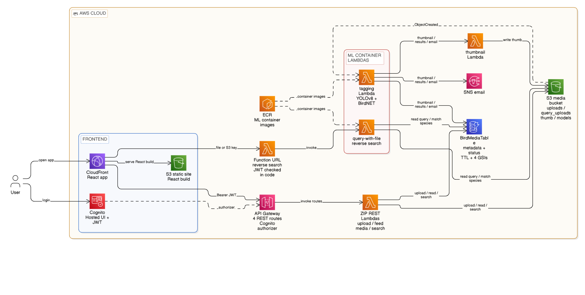
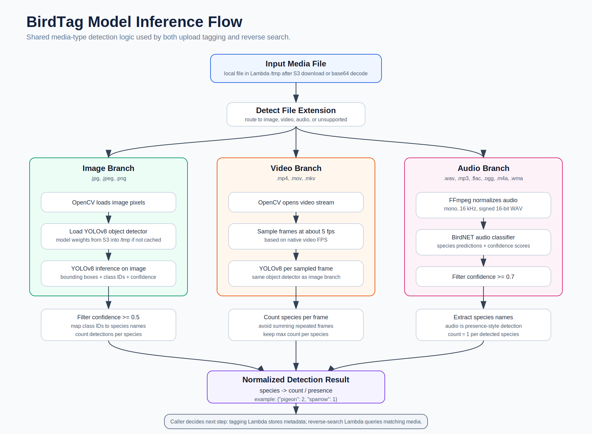
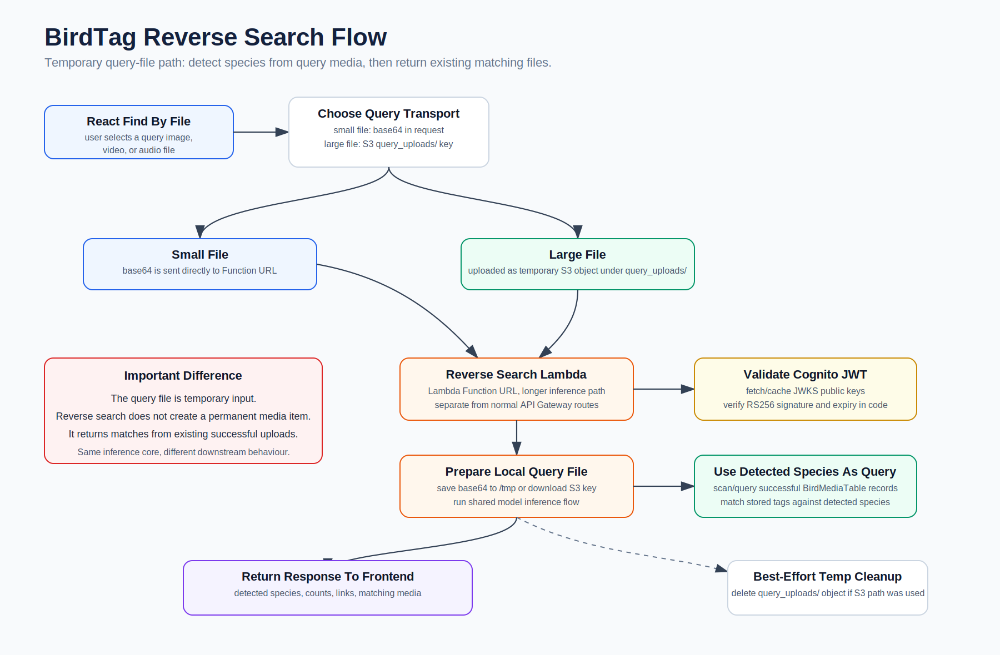

# BirdTag

A serverless bird media platform that lets you upload images, videos, and audio files of birds. It automatically detects species using AI and lets everyone search through the community uploads.

---

## 🚀 **[Try the Live Demo Here](https://d1le71nhpvak40.cloudfront.net/)** 🚀

---

## Overview

BirdTag uses computer vision and audio analysis to identify bird species in your uploads. You can search through community uploads by species name, upload your own media for reverse search, and get email notifications when new birds are detected.

## Key Features

- **Multi-format Support**: Works with images (JPG, PNG), videos (MP4, MOV, MKV), and audio files (WAV, MP3, FLAC, OGG, M4A, WMA)
- **Dual AI Detection**: YOLOv8 for visual detection (7 species) + BirdNET for audio analysis (6,000+ species)
- **Real-time Processing**: Automatic species detection with confidence filtering
- **Community Feed**: Browse all uploaded bird media with pagination
- **Advanced Search**: Search by species name with OR/AND logic, reverse image search, count-based filtering
- **Email Notifications**: Get alerts for new bird detections and tag changes
- **Tag Management**: Edit species tags with automatic notifications

## Tech Stack

### Frontend
- **Framework**: React 19.1.0
- **Build Tool**: Vite 6.3.5
- **Routing**: React Router DOM 7.1.3
- **Styling**: CSS Modules
- **Authentication**: AWS Cognito with JWT tokens

### Backend
- **Compute**: AWS Lambda (Node.js 18.x, Python 3.12)
- **Storage**: Amazon S3 (multi-bucket architecture)
- **Database**: DynamoDB (single-table design)
- **Authentication**: Amazon Cognito User Pools
- **API**: Amazon API Gateway (REST)
- **Notifications**: Amazon SNS (email subscriptions)
- **Container Registry**: Amazon ECR (for ML-heavy Lambdas)

### AI/ML Models
- **YOLOv8**: Custom-trained model for 7 bird species (50% confidence threshold)
- **BirdNET v0.1.7**: Pre-trained audio model for 6,000+ global species (70% confidence threshold)

### DevOps
- **Containerization**: Docker (for Lambda deployment)
- **Media Processing**: FFmpeg (audio conversion to mono 16kHz)
- **Image Processing**: OpenCV, Pillow
- **Package Management**: npm (frontend), pip (backend)

## Project Structure

```
BirdTag/
├── client/                 # React frontend application
│   ├── src/
│   │   ├── pages/         # Route components
│   │   ├── components/    # Reusable UI components
│   │   ├── utils/         # Helper functions
│   │   └── config.js      # API Gateway endpoints
│   └── README.md          # Frontend-specific documentation
├── aws/
│   └── lambda/            # AWS Lambda functions
│       ├── presigned_url/           # S3 upload URL generation (Node.js)
│       ├── species_detection/       # AI detection (Python + Docker)
│       ├── file_query/              # Reverse search (Python + Docker)
│       ├── feed_fetch/              # Feed pagination (Python)
│       ├── my_uploaded_files/       # User files retrieval (Python)
│       ├── generate_thumbnail/      # Image resizing (Python)
│       ├── email_auto_verify/       # Cognito trigger - skip OTP (Python)
│       ├── sns_auto_signup/         # Cognito trigger - auto-subscribe (Python)
│       └── query_media_files/       # Search & modify operations (Python)
│   └── README.md          # AWS deployment guide
├── models/
│   ├── yolov8/            # YOLOv8 model weights (model.pt)
│   └── birdnet/           # BirdNET auto-downloads at runtime
├── API_ENDPOINTS.md       # API documentation
└── ENVIRONMENT_SETUP.md   # Environment variables guide
```

## Architecture Overview



## Architecture Flow

### Upload & Detection Flow
```
User uploads file → Presigned URL Lambda → S3 (uploads/)
  ↓ (S3 Event Trigger)
Species Detection Lambda → YOLOv8/BirdNET inference
  ↓
DynamoDB (metadata storage) + S3 (thumbnails) + SNS (email notifications)
```

### Search Flow
```
User searches by species → Query Lambda → DynamoDB scan
  ↓
Filtered results with pagination → Frontend display
```

### Reverse Search Flow
```
User uploads query file → File Query Lambda → AI detection
  ↓
Query DynamoDB for matching species → Return similar files
```

## Model Inference Flow



The same media-type detection logic is used by both the normal upload/tagging pipeline and reverse search. Image and video files use YOLOv8 object detection, while audio files use BirdNET after FFmpeg normalization.

#### Reverse Search Processing



Reverse search uses the same inference core, but the uploaded query file is temporary. The detected species become search terms against successful media records in DynamoDB instead of creating a permanent media item.

## Supported Bird Species

### YOLOv8 (Visual Detection)
- Crow
- Kingfisher
- Myna
- Owl
- Peacock
- Pigeon
- Sparrow

### BirdNET (Audio Detection)
- 6,000+ global bird species with scientific classification

## Setup & Deployment

### Prerequisites
- Node.js 18.x or higher
- Python 3.12
- AWS CLI configured with appropriate credentials
- Docker (for Lambda container deployment)

### Frontend Setup
```bash
cd client
npm install
npm run dev
```

See `client/README.md` for detailed instructions.

### Backend Deployment
```bash
cd aws/lambda
# See aws/README.md for Lambda-specific deployment steps
```

See `aws/README.md` for detailed AWS infrastructure setup.

## Environment Variables

### Frontend (.env)
```
VITE_API_GATEWAY_URL=https://your-api-gateway-url
VITE_USER_POOL_ID=your-cognito-user-pool-id
VITE_COGNITO_CLIENT_ID=your-cognito-client-id
VITE_S3_BUCKET_NAME=your-s3-bucket-name
VITE_QUERY_WITH_FILE_LAMBDA_URL=https://your-file-query-lambda-url
```

### Backend (Lambda Environment Variables)
- `S3_BUCKET_NAME`: Main S3 bucket for uploads
- `DYNAMODB_TABLE_NAME`: DynamoDB table for metadata
- `COGNITO_USER_POOL_IDS`: Semicolon-separated User Pool IDs
- `SNS_TOPIC_ARN`: SNS topic for notifications
- `THUMBNAIL_LAMBDA_ARN`: ARN for thumbnail generation Lambda

See `ENVIRONMENT_SETUP.md` for complete configuration.

## Production Hardening Notes

The current project keeps a few areas intentionally simple for a portfolio/demo deployment. In production, the backend should derive the user identity from verified Cognito JWT claims instead of trusting client-supplied `userEmail` values, and the S3 bucket should include a lifecycle rule for `query_uploads/` so interrupted reverse-search uploads are cleaned up even if the Lambda times out or crashes before its own cleanup block runs.

## Security Features

- JWT token validation on all API endpoints
- Presigned S3 URLs with 5-minute expiry
- TTL-based auto-deletion of failed uploads (24 hours)
- CORS configuration for API Gateway
- S3 object tagging for status tracking
- No sensitive data logging in production

## Performance Optimizations

- Lazy loading for media previews
- Thumbnail generation for images (256x256)
- DynamoDB pagination for large datasets
- Lambda cold start optimization with /tmp caching
- Video frame sampling at 5fps for detection
- Audio conversion to mono 16kHz for efficiency

## API Endpoints

- `POST /presignedurl` - Generate S3 upload URL
- `GET /feed` - Retrieve paginated feed
- `POST /query_raw` - Search by species, list species, modify tags
- `Lambda Function URL` - Reverse image/video/audio search
- `GET /my-media` - User's uploaded files
